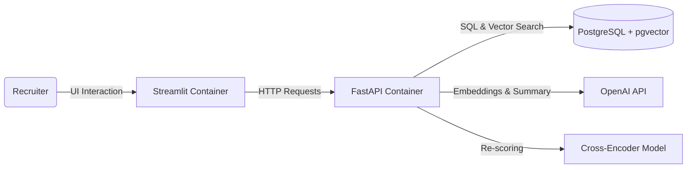

# 🤖 AI Recruitment Assistant (RAG + LangGraph)

An intelligent Application Tracking System (ATS) powered by **Hybrid Search** (Semantic + Keyword) and **AI Agents** for automated resume analysis.

The project is built with a modern microservices architecture and fully orchestrated using **Docker Compose**.

## 🏗 Architecture

The system consists of three isolated services running in a private Docker network:

1.  **Backend (FastAPI)**: Handles business logic, PDF parsing, embedding generation, and database interactions.
2.  **Frontend (Streamlit)**: An interactive UI for recruiters to onboard candidates and perform advanced searches.
3.  **Database (PostgreSQL + pgvector)**: Stores structured candidate data and vector embeddings for similarity search.



## 🚀 Key Features

* **📄 Intelligent Parsing:** A **LangGraph**-based workflow that extracts structured data (Skills, Experience, Education) from PDF resumes of any format.
* **🧠 AI Summarization:** Automatically generates concise professional profiles using GPT-4o.
* **🎯 Two-Stage Search Engine (RAG):**
  * **Stage 1: Retrieval (Hybrid Search):** Quickly fetches top candidates using **Vector Search** (OpenAI Embeddings) combined with **SQL Filters** (Location, Experience) via pgvector.
  * **Stage 2: Reranking (Precision):** A specialized **Cross-Encoder model** (`ms-marco-MiniLM-L-6-v2`) deeply analyzes the retrieved candidates against the query to re-rank them, ensuring the most relevant results appear at the top.
* **📊 RAG Evaluation System:** Comprehensive evaluation framework to measure and compare search quality with metrics like Precision@K, Recall@K, MRR, NDCG, and MAP. Includes automated test query generation and HTML report visualization.
* **🔒 Rate Limiting:** Protects API endpoints from abuse with configurable request limits per time window, supporting both IP-based and API key-based throttling.
* **🐳 Dockerized:** One-command deployment for the entire stack.

## 🛠 Tech Stack

* **Language:** Python 3.11
* **Orchestration:** Docker & Docker Compose
* **Backend:** FastAPI, Pydantic, Asyncpg
* **Frontend:** Streamlit
* **Database:** PostgreSQL 15, pgvector extension
* **AI & LLM:** LangChain, LangGraph, OpenAI (GPT-4o / Text-Embeddings-3-Small)
* **ML & Reranking:** sentence-transformers (CrossEncoder)

## ⚙️ Installation & Setup

### Prerequisites

* Docker & Docker Compose installed
* An OpenAI API Key

### 1. Clone the repository

```bash
git clone https://github.com/Vladislav1753/rag-candidate-system.git
cd rag-candidate-system
```

### 2. Environment Setup

Create a `.env` file in the root directory:

```ini
DB_USER=admin
DB_PASSWORD=admin
DB_NAME=candidates
DB_PORT=5433

OPENAI_API_KEY=sk-your-openai-key-here

# Backend URL for local development (Overridden automatically in Docker)
API_URL=http://127.0.0.1:8000

# Redis Configuration
REDIS_URL=redis://redis:6379         # For Docker environment
# REDIS_URL=redis://localhost:6379   # For local development
CACHE_TTL=3600                       # Cache TTL in seconds (1 hour)

# Rate Limiting Configuration (Optional)
# Format: "number/time_unit" where time_unit can be: second, minute, hour, day
RATE_LIMIT_SEARCH=20/minute       # Search endpoint limit
RATE_LIMIT_ONBOARDING=10/minute   # Candidate onboarding limit
RATE_LIMIT_EXTRACT=10/minute      # PDF extraction limit
RATE_LIMIT_DEFAULT=100/minute     # Default for all other endpoints
```

### 3. Run with Docker

Build and start the containers:

```bash
docker compose up --build -d
```

### 4. Populate the Database (Optional)

If you want to seed the database with sample candidates from a CSV file, run the migration script:

```bash
python -m scripts.migrate_csv
```

> **Note:** Make sure you have a `data/candidates_pool.csv` file prepared. The script will read the CSV, generate embeddings for each candidate, and insert them into PostgreSQL.

### 5. Access the Application

Once the containers are running:

* **Frontend UI:** [http://localhost:8501](https://www.google.com/search?q=http://localhost:8501)
* **Backend Docs (Swagger):** [http://localhost:8000/docs](https://www.google.com/search?q=http://localhost:8000/docs)
* **Database:** `localhost:5433` (User/Pass: admin/admin)

## 📊 RAG Evaluation

The project includes a comprehensive evaluation system to measure and improve search quality.

To run the evaluation suite and generate quality metrics reports:

```bash
# Generate synthetic test queries
python evaluation/test_queries.py

# Run evaluation with metrics calculation
python evaluation/run_evaluation.py

# Generate HTML report with visualizations
python evaluation/generate_report.py
```

📖 **For detailed information about the evaluation system, metrics used, and how to interpret results, see [evaluation/README.md](evaluation/README.md)**

## 🔒 Rate Limiting

The API includes built-in rate limiting to protect against abuse and ensure fair usage. Each endpoint has configurable request limits.

📖 **For detailed information about rate limiting configuration, usage, and best practices, see [app/middleware/README.md](app/middleware/README.md)**

## ⚡ Redis Caching

The system uses Redis to cache search results, dramatically improving response times for repeated queries.

### Cache Features

* **Automatic Caching:** Search results are automatically cached based on query text and filters
* **Smart Key Generation:** Uses MD5 hashing of query parameters to create unique cache keys
* **Configurable TTL:** Default cache expiration is 1 hour (configurable via `CACHE_TTL` env variable)
* **Cache Invalidation:** Manual cache clearing via API endpoint
* **Performance Monitoring:** Real-time cache statistics (hit rate, key count, etc.)

### Cache Management Endpoints

**Get Cache Statistics:**
```bash
curl http://localhost:8000/cache/stats
```

**Invalidate All Cache:**
```bash
curl -X POST http://localhost:8000/cache/invalidate
```

### Performance Impact

With caching enabled:
- **First query:** ~500-1000ms (full search + reranking)
- **Cached query:** ~5-20ms (direct Redis retrieval)
- **95%+ reduction** in response time for repeated queries
- **Lower API costs** by avoiding redundant OpenAI embedding calls

📖 **For detailed information about caching architecture, configuration, and best practices, see [app/core/README.md](app/core/README.md)**

## 🧪 Development

To stop the containers:

```bash
docker compose down
```

To view logs (useful for debugging):

```bash
docker compose logs -f
```
