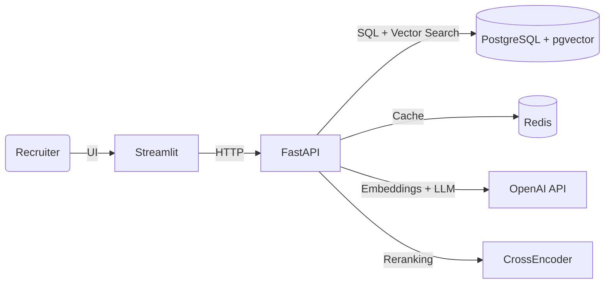

# AI Recruitment Assistant (RAG + LangGraph)

An AI-powered recruitment assistant for candidate onboarding, resume parsing, semantic search, reranking, query expansion, and RAG evaluation.

The project currently runs as a Docker Compose stack:

- FastAPI backend
- Streamlit frontend
- PostgreSQL + pgvector
- Redis

## Architecture


```mermaid
graph LR
    User(Recruiter) -->|UI| Frontend[Streamlit]
    Frontend -->|HTTP| Backend[FastAPI]
    Backend -->|SQL + Vector Search| DB[(PostgreSQL + pgvector)]
    Backend -->|Cache| Redis[(Redis)]
    Backend -->|Embeddings + LLM| OpenAI[OpenAI API]
    Backend -->|Reranking| Reranker[CrossEncoder]
```

## Features

- PDF resume text extraction.
- LangGraph-based structured resume extraction.
- Candidate onboarding into PostgreSQL.
- OpenAI embeddings for candidate search.
- PostgreSQL pgvector semantic search.
- CrossEncoder reranking.
- Redis caching for search and query expansion results.
- Rate limiting with SlowAPI.
- AI query expansion.
- RAG evaluation scripts and reports.
- Docker Compose setup for local development.

## Tech Stack

- Python 3.11
- FastAPI
- Streamlit
- PostgreSQL 15 + pgvector
- Redis
- Asyncpg
- OpenAI
- LangChain / LangGraph
- sentence-transformers
- pytest
- ruff
- mypy
- uv

## Project Setup

### Prerequisites

- Python 3.11
- Docker and Docker Compose
- uv
- OpenAI API key

Install `uv` if needed:

```bash
pip install uv
```

### Environment

Create a `.env` file in the project root. Use `.env.example` as a starting point:

```bash
cp .env.example .env
```

Required values include:

```ini
OPENAI_API_KEY=your_api_key_here

DB_USER=admin
DB_PASSWORD=admin
DB_NAME=candidates
DB_PORT=5433

REDIS_URL=redis://redis:6379
CACHE_TTL=3600

ADMIN_API_KEY=your_admin_api_key_here

RATE_LIMIT_SEARCH=20/hour
RATE_LIMIT_ONBOARDING=20/hour
RATE_LIMIT_EXTRACT=20/hour
RATE_LIMIT_DEFAULT=20/hour
```

For local non-Docker Redis usage, `REDIS_URL` may need to be:

```ini
REDIS_URL=redis://localhost:6379
```

## Dependency Management

This project uses `pyproject.toml` and `uv.lock`.

`pyproject.toml` describes allowed dependencies and tool settings.

`uv.lock` fixes the exact dependency versions, including transitive dependencies. Commit `uv.lock` to git.

Install the development environment:

```bash
uv sync --group dev --extra frontend --extra evaluation
```

If you only need backend runtime dependencies:

```bash
uv sync
```

Update the lock file after dependency changes:

```bash
uv lock
```

## Make Commands

The project includes a `Makefile` with common commands.

```bash
make install
```

Installs dependencies from `pyproject.toml` / `uv.lock` with dev, frontend, and evaluation extras.

```bash
make test
```

Runs the test suite with pytest.

```bash
make typecheck
```

Runs mypy on the main backend/RAG code:

```bash
app rag
```

```bash
make lint
```

Runs Ruff checks.

```bash
make lint-fix
```

Runs Ruff checks and applies safe automatic fixes.

```bash
make format
```

Formats code with Ruff.

```bash
make pre-commit
```

Runs all pre-commit hooks on all files.

```bash
make up
```

Starts the Docker Compose stack.

```bash
make up-build
```

Builds and starts the Docker Compose stack.

```bash
make down
```

Stops the Docker Compose stack.

```bash
make down-v
```

Stops the Docker Compose stack and removes volumes.

```bash
make logs
```

Streams Docker Compose logs.

## Running the Project

Recommended local workflow:

```bash
make install
make up-build
```

Once the containers are running:

- Frontend UI: http://localhost:8501
- Backend Swagger docs: http://localhost:8000/docs
- PostgreSQL: localhost:5433

The backend expects PostgreSQL and Redis to be available during startup, so running the backend alone with Uvicorn may fail unless those services are already running and configured correctly.

## Database Seed

To seed candidates from `data/candidates_pool.csv`:

```bash
python -m scripts.migrate_csv
```

This script reads candidate data, generates embeddings, and inserts rows into PostgreSQL.

Note: the project does not yet have Alembic migrations. Database schema reproducibility is part of the planned refactoring work.

## RAG Evaluation

Generate synthetic test queries:

```bash
python evaluation/test_queries.py
```

Run evaluation:

```bash
python evaluation/run_evaluation.py
```

Generate HTML report:

```bash
python evaluation/generate_report.py
```

See `evaluation/README.md` for more details.

## API Examples

### Query Expansion

```bash
curl -X POST http://localhost:8000/expand-query \
  -H "Content-Type: application/json" \
  -d "{\"query\": \"python lead\"}"
```

Example response:

```json
{
  "status": "success",
  "original_query": "python lead",
  "expanded_query": "Senior Python Developer, Team Lead, Django, Flask, FastAPI, System Architecture, Microservices",
  "cached": false
}
```

### Cache Stats

Protected by `X-API-Key`:

```bash
curl http://localhost:8000/cache/stats \
  -H "X-API-Key: your_admin_api_key_here"
```

### Cache Invalidation

```bash
curl -X DELETE http://localhost:8000/cache \
  -H "Content-Type: application/json" \
  -H "X-API-Key: your_admin_api_key_here" \
  -d "{\"scopes\": [\"search\", \"expand\"]}"
```

## Development Notes

Current refactoring direction:

- keep `pyproject.toml` as the source of dependency metadata;
- keep `uv.lock` committed for reproducible installs;
- use `make test`, `make lint`, and `make typecheck` before changes are committed;
- gradually move configuration to `pydantic-settings`;
- split `app/main.py` into routers, schemas, dependencies, and services;
- add Alembic migrations for PostgreSQL schema management;
- move raw SQL into repository/data access modules.

## Useful Files

- `pyproject.toml` - project metadata, dependencies, and tool configuration.
- `uv.lock` - exact dependency lock file.
- `Makefile` - common development commands.
- `docker-compose.yml` - local service orchestration.
- `app/main.py` - current FastAPI entrypoint.
- `rag/` - RAG retrieval, reranking, embedding, and agents.
- `evaluation/` - RAG evaluation utilities.
- `docs/ENGINEERING_REVIEW_AND_REFACTORING_GUIDE.md` - detailed refactoring guide.
- `docs/PRODUCTION_READINESS_GAP_ANALYSIS.md` - production readiness checklist and gaps.
