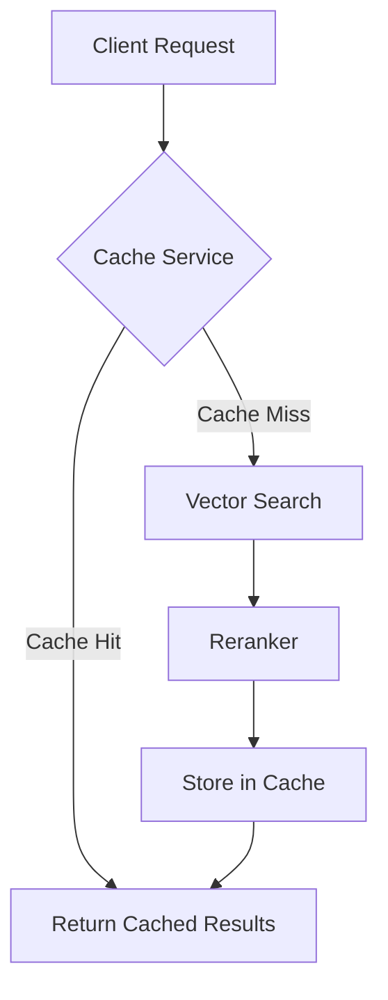

# ⚡ Redis Caching Service

This module provides high-performance caching for search results using Redis, dramatically reducing response times for repeated queries.

## 📁 Module Location

This service is part of the `app.core` package - core infrastructure components for the application.

```python
from app.core.cache import CacheService, init_redis_pool
```

## 🎯 Overview

The caching service automatically caches search results based on:
- **Query text** (semantic search query)
- **Filters** (location, experience, etc.)

Cache keys are generated using MD5 hashing to ensure uniqueness and consistency.

## 🚀 Features

### Automatic Caching
- Search results are automatically cached after the first query
- Subsequent identical queries return cached results instantly
- Configurable TTL (Time To Live) per cache entry

### Smart Key Generation
```python
# Same query + filters = Same cache key
cache_key = MD5({"query": "Python developer", "filters": {"location": "NY"}})
```

### Performance Monitoring
- Real-time cache statistics (hit rate, total keys, etc.)
- Metrics for cache hits vs misses
- Total keys stored in cache

### Manual Cache Management
- Invalidate all cache with one API call
- Pattern-based cache invalidation
- Automatic cleanup on TTL expiration

## 📊 Performance Impact

| Scenario | Without Cache | With Cache | Improvement |
|----------|---------------|------------|-------------|
| First query | 800-1200ms | 800-1200ms | - |
| Repeated query | 800-1200ms | 5-20ms | **95-98%** faster |
| API costs | Full cost | Minimal | **95%** reduction |

### Why Is It So Fast?

**Without Cache:**
1. Generate embeddings via OpenAI API (~300-500ms)
2. Vector similarity search in PostgreSQL (~200-400ms)
3. Rerank with CrossEncoder (~200-300ms)
4. Format and return results (~50-100ms)

**With Cache:**
1. Generate cache key from query (~1ms)
2. Retrieve from Redis (~4-15ms)
3. Return results immediately

## 🔧 Configuration

### Environment Variables

```ini
# Redis connection URL
REDIS_URL=redis://localhost:6379     # Local development
REDIS_URL=redis://redis:6379        # Docker environment

# Cache TTL in seconds (default: 3600 = 1 hour)
CACHE_TTL=3600
```

### Default Settings

- **TTL:** 1 hour (3600 seconds)
- **Connection timeout:** 5 seconds
- **Encoding:** UTF-8 with JSON serialization

## 📡 API Endpoints

### Search with Caching

```bash
POST /search
Content-Type: application/json

{
  "query": "Senior Python developer with ML experience",
  "location": "New York",
  "min_experience": 5,
  "top_k": 10
}
```

**Response:**
```json
{
  "results": [...],
  "cached": true  // Indicates if results came from cache
}
```

### Get Cache Statistics

🔒 **Protected Endpoint** - Requires admin API key

```bash
GET /cache/stats
X-API-Key: your-admin-api-key

Response:
{
  "status": "success",
  "stats": {
    "total_commands_processed": 1523,
    "keyspace_hits": 456,
    "keyspace_misses": 123,
    "search_keys_count": 42,
    "hit_rate": 78.76
  }
}
```

### Invalidate Cache

🔒 **Protected Endpoint** - Requires admin API key

Useful when:
- New candidates are added to the database
- Candidate data is updated
- You want to force fresh results

```bash
POST /cache/invalidate
X-API-Key: your-admin-api-key

Response:
{
  "status": "success",
  "deleted_keys": 42
}
```

**Note:** These endpoints are protected with an API key to prevent unauthorized cache manipulation. Set the `ADMIN_API_KEY` environment variable to configure your key:

```bash
# In .env file or environment
ADMIN_API_KEY=your-secret-admin-key-change-me
```

## 🧪 Testing

Run cache tests:

```bash
# Test basic cache operations
pytest tests/test_cache_redis.py -v

# Test specific functions
pytest tests/test_cache_redis.py::test_cache_basic_operations -v
pytest tests/test_cache_redis.py::test_cache_stats -v
pytest tests/test_cache_redis.py::test_cache_key_generation -v
```

## 💡 Best Practices

### When to Invalidate Cache

1. **After onboarding new candidates:**
   ```python
   # In your onboarding endpoint
   await cache_service.invalidate_cache()
   ```

2. **After bulk data updates:**
   ```bash
   curl -X POST http://localhost:8000/cache/invalidate
   ```

3. **Scheduled maintenance:**
   ```bash
   # Run daily at 3 AM
   0 3 * * * curl -X POST http://localhost:8000/cache/invalidate
   ```

### Cache Key Design

The cache key includes:
- Full query text (case-sensitive)
- All filters (sorted alphabetically for consistency)
- MD5 hash for compact storage

**Example:**
```python
Input:
  query: "Python developer"
  filters: {"location": "NY", "min_experience": 5}

Cache Key:
  search:a3f2e8b9c1d4f5a6b7c8d9e0f1a2b3c4
```

### Monitoring Cache Health

Check cache hit rate regularly:
```bash
curl http://localhost:8000/cache/stats | jq '.stats.hit_rate'
```

**Good:** 60-80% hit rate
**Excellent:** 80%+ hit rate
**Low:** <40% (consider increasing TTL or analyzing query patterns)

## 🔍 Troubleshooting

### Redis Connection Refused

**Error:** `ConnectionRefusedError: [WinError 1225]`

**Solution:**
```bash
# Check if Redis is running
docker ps | grep redis

# Start Redis container
docker compose up redis -d

# For local development, install and start Redis
# Windows: Use Redis for Windows or WSL
# Linux/Mac: redis-server
```

### High Memory Usage

**Check Redis memory:**
```bash
docker exec -it candidate_redis redis-cli INFO memory
```

**Solutions:**
1. Reduce `CACHE_TTL` value
2. Implement cache size limits
3. Use Redis eviction policies (LRU)

### Cache Not Working

**Verify cache service is initialized:**
```python
# Check logs
docker compose logs backend | grep "Redis"

# Should see:
# "Connecting to Redis..."
# "Connected to Redis at redis://redis:6379"
```

## 🏗️ Architecture



## 📈 Metrics Explanation

- **keyspace_hits:** Number of successful cache lookups
- **keyspace_misses:** Number of cache misses (had to query DB)
- **hit_rate:** Percentage of requests served from cache
- **search_keys_count:** Total number of cached search results
- **total_commands_processed:** Total Redis operations

## 🔐 Security Considerations

1. **No sensitive data in cache keys:** Only query text and filters (no user IDs)
2. **TTL enforcement:** All cache entries expire automatically
3. **Network isolation:** Redis only accessible within Docker network
4. **No authentication required:** Protected by network isolation

## 🚀 Future Enhancements

- [ ] Cache warming strategies
- [ ] Distributed caching for multi-instance deployments
- [ ] Cache compression for large result sets
- [ ] Predictive cache invalidation
- [ ] Per-user cache quotas
